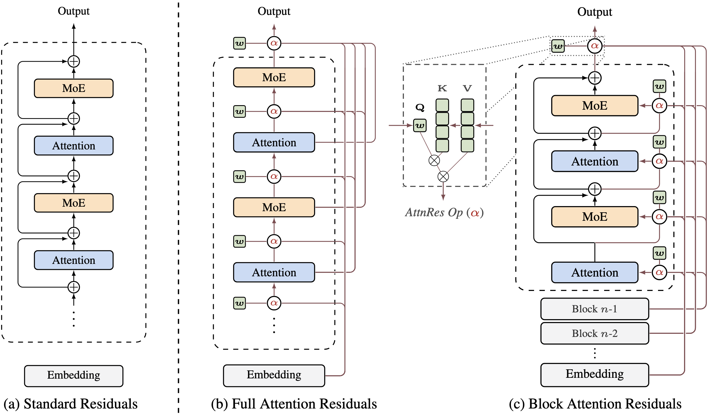

## Attention Residuals

A minimal, readable PyTorch implementation of **Attention Residuals (AttnRes)** — a residual replacement mechanism inspired by the paper **"Attention Residuals"** from Kimi Team.

Instead of always adding the previous hidden state through a fixed residual connection, AttnRes learns to **soft-select which earlier states should contribute** to the next representation.

This repository is designed to be:
- **Easy to read** for researchers and students
- **Easy to hack** for experimentation
- **Easy to reuse** inside your own Transformer variants

---

## Architecture overview

Before diving into the code, the following figure from the **Attention Residuals** paper shows the core idea at a glance: **Standard Residuals**, **Full Attention Residuals**, and **Block Attention Residuals** side by side.

<p align="center">
  
</p>
<p align="center"><em>Overview of Attention Residuals from the original paper.</em></p>

At a high level:
- **Standard Residuals** use a fixed additive shortcut
- **Full Attention Residuals** learn to aggregate over all earlier layer outputs
- **Block Attention Residuals** preserve the main idea while improving scalability

---

## Why Attention Residuals?

Standard residual connections are simple and effective, but they always inject the previous hidden state through a fixed additive path.

Attention Residuals make this path **adaptive**:
- **Full Attention Residuals** aggregate over all previous layer outputs
- **Block Attention Residuals** aggregate over block-level intermediate states
- A learned pseudo-query scores candidate states after normalization
- The final residual signal becomes a **softmax-weighted combination** of prior representations

In practice, this makes the residual pathway more expressive while keeping the implementation compact.

This repository implements the core building blocks behind that idea in a form that is easy to inspect, modify, and reuse.

---

## What is included

This repo currently includes:

- **`AttnRes`**: the core residual aggregation module
- **`FullAttnResTransformerBlock`**: Transformer block with full attention residual aggregation
- **`BlockAttnResTransformerBlock`**: Transformer block with block-level attention residual aggregation

Project structure:

```text
attention-residuals/
├── assets/
│   └── images/
│       └── attnres.png
├── attention_residuals/
│   ├── attn_residuals.py
│   └── attn_residuals_transformer.py
├── LICENSE
└── README.md
```

---

## Highlights

- **Minimal PyTorch implementation**
- **Research-friendly code structure**
- **Clean separation** between the core residual operator and Transformer blocks
- **MIT License** for flexible reuse
- **Good starting point** for ablations, benchmarks, and architecture exploration

With the high-level idea in place, the sections below show how to use the implementation directly.

---

## Quick start

### Core `AttnRes` module

```python
import torch
from attention_residuals.attn_residuals import AttnRes

batch_size, seq_len, dim = 2, 16, 64

layer_outputs = [
    torch.randn(batch_size, seq_len, dim),
    torch.randn(batch_size, seq_len, dim),
]
current_output = torch.randn(batch_size, seq_len, dim)

attn_res = AttnRes(hidden_dim=dim)
aggregated = attn_res(layer_outputs, current_output)

print(aggregated.shape)  # [2, 16, 64]
```

### Full Attention Residual Transformer block

```python
import torch
from attention_residuals.attn_residuals_transformer import FullAttnResTransformerBlock

batch_size, seq_len, dim = 2, 16, 128
x = torch.randn(batch_size, seq_len, dim)
layer_outputs = [x]

block = FullAttnResTransformerBlock(
    hidden_dim=dim,
    intermediate_dim=256,
    num_heads=8,
)

hidden_states, layer_outputs = block(x, layer_outputs)
print(hidden_states.shape)  # [2, 16, 128]
```

### Block Attention Residual Transformer block

```python
import torch
from attention_residuals.attn_residuals_transformer import BlockAttnResTransformerBlock

batch_size, seq_len, dim = 2, 16, 128
hidden_states = torch.randn(batch_size, seq_len, dim)
block_outputs = [hidden_states]

block = BlockAttnResTransformerBlock(
    hidden_dim=dim,
    intermediate_dim=256,
    num_heads=8,
    block_size=4,
    layer_number=2,
)

hidden_states, block_outputs = block(hidden_states, block_outputs)
print(hidden_states.shape)  # [2, 16, 128]
```

---

## How it works

At a high level, AttnRes replaces a fixed residual addition with:

$$
h = \sum_i \alpha_i v_i
$$

where:
- $v_i$ are candidate states from previous layers or blocks
- $\alpha_i$ are attention weights produced by a learned pseudo-query
- normalized candidate states are scored and combined through a softmax

This gives each layer a learnable mechanism for deciding **which past representations matter most**.

---

## Current scope

This repository is best viewed as a **clean reference implementation** rather than a full training framework.

It currently focuses on:
- core modules
- Transformer block variants
- clarity over framework complexity

---

## Ideal use cases

- **Reading the paper with runnable code nearby**
- **Testing alternative residual designs**
- **Plugging AttnRes into your own language model prototypes**
- **Educational exploration of adaptive residual pathways**

---

## Star this repo

If you find this project useful, consider giving it a star.

A strong open-source project usually wins because it is:
- **simple to understand**
- **easy to try**
- **honest about scope**
- **useful as a building block**

This README is written with exactly that goal in mind.
